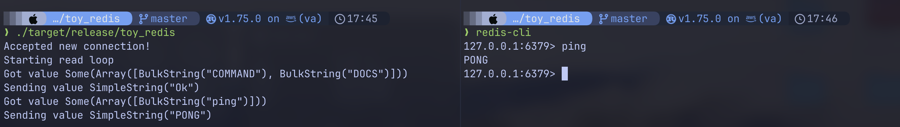
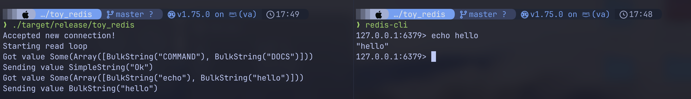
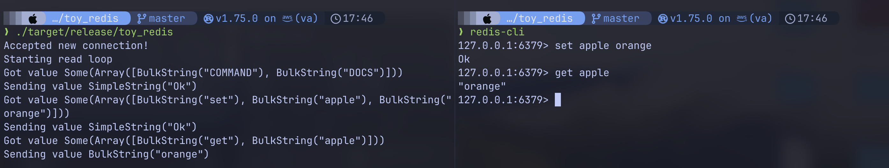
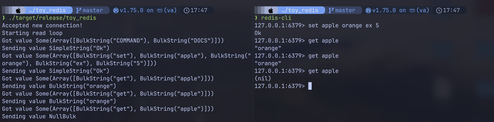

# Toy Redis
This project was made to learn more about redis and improve my Rust skills.

## Features
Toy redis runs a TCP server that `redis-cli` command can directly interface with using the redis serialization protocol.

Some commands implemented are:

1. Ping 
2. Echo 
3. Set and Get 
4. Set with expiration 
